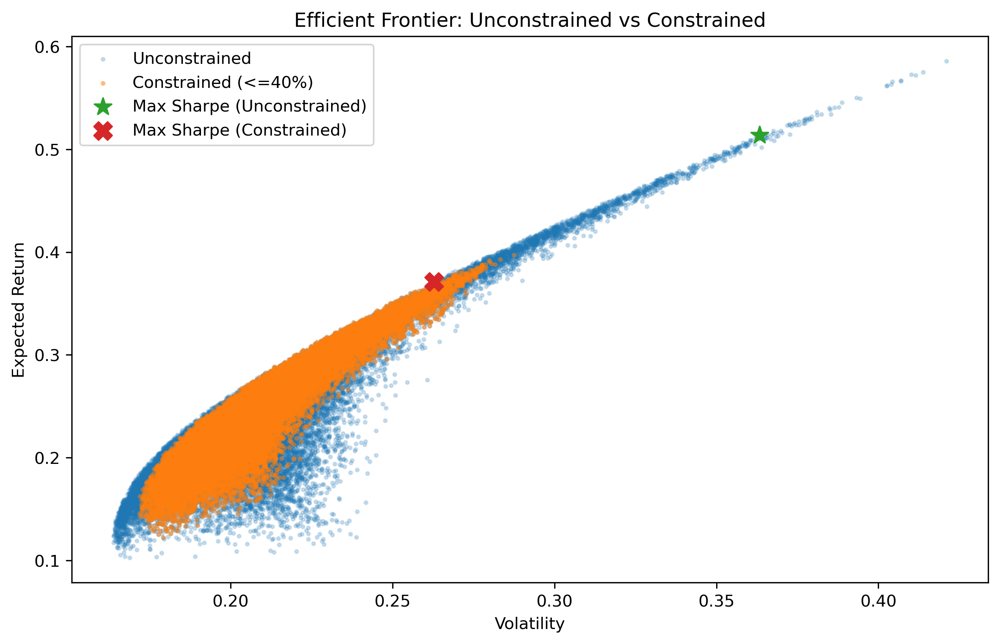
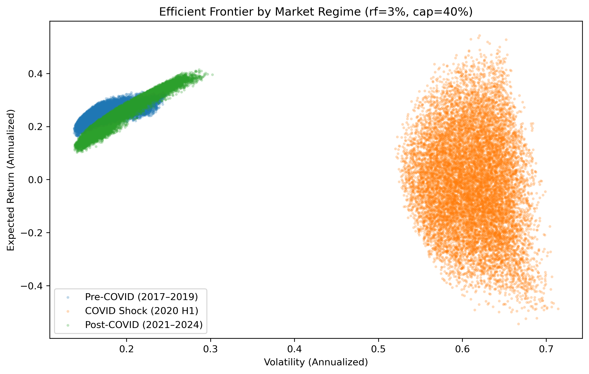

# Stock Price Volatility & Portfolio Simulation

## 📌 Project Overview

This project analyzes equity portfolio construction across multiple market regimes using historical return and covariance estimation.

The objective is not to predict stock prices, but to evaluate how portfolio optimization behaves under uncertainty, how diversification works in practice, and how constraints improve robustness.

---

## 🎯 Project Question

How can portfolio construction techniques balance return and risk more effectively than naïve allocation strategies using historical stock data?

Specifically:

- How volatile are individual assets?
- How does correlation structure affect diversification?
- What trade-offs emerge across thousands of simulated portfolios?
- How do optimal allocations change across market regimes?
- Does imposing realistic constraints improve robustness?

---

## 🔍 Scope & Assumptions

- Historical returns are used as descriptive inputs, not forecasts.
- Returns are assumed weakly stationary within defined regime windows.
- Transaction costs and taxes are excluded to isolate structural portfolio behavior.
- Equity-only universe to maintain interpretability.

The goal is to understand structural trade-offs in portfolio construction — not to build a trading strategy.

---

## 🧠 Asset Universe

Six large-cap U.S. equities selected to represent distinct economic risk drivers:

- **NVDA** – Semiconductors / AI Growth  
- **MSFT** – Enterprise Technology  
- **JNJ** – Defensive Healthcare  
- **JPM** – Financials  
- **RTX** – Industrials & Defense  
- **V** – Payments / Consumer Transactions  

These assets were intentionally chosen for diversification analysis rather than return maximization.

---

## 📅 Time Horizon

- Daily data from **2014–2024**
- Approximately 10 years of market regimes including:
  - Pre-COVID stability
  - COVID shock
  - Post-COVID recovery and rate cycle

---

## 📊 Benchmark

- **S&P 500 Index (^GSPC)**

Used for performance and risk comparison.

---

## 🛠 Methodology

### Phase 1–2: Data Engineering
- Pulled historical daily prices via `yfinance`
- Extracted Adjusted Close prices
- Aligned assets on common trading dates
- Computed daily return matrix

### Phase 3–4: Risk Structure Analysis
- Annualized return and volatility
- Covariance and correlation matrices
- Rolling volatility analysis
- Diversification diagnostics (average correlation, marginal contribution to risk)

### Phase 5: Monte Carlo Portfolio Simulation
- Simulated 30,000+ portfolios
- Constructed Efficient Frontier
- Identified:
  - Max Sharpe Portfolio
  - Minimum Volatility Portfolio
  - Equal Weight Baseline

### Phase 5.5: Professional Constraint Upgrade
- Introduced 3% risk-free rate
- Applied 40% weight cap
- Compared unconstrained vs constrained frontier

### Phase 6: Downside Risk & Stress Testing
- Historical VaR and CVaR (95% & 99%)
- Maximum drawdown
- Worst daily loss
- COVID stress-window analysis

### Phase 7: Regime Analysis
- Re-estimated covariance per regime:
  - Pre-COVID (2017–2019)
  - COVID Shock (2020 H1)
  - Post-COVID (2021–2024)
- Reconstructed constrained frontiers per regime
- Analyzed weight evolution across macro environments

---

## 📈 Key Findings

- Unconstrained optimization produced extreme concentration (up to 70% NVDA), resulting in severe drawdowns (-55%).
- Introducing a 40% weight cap reduced drawdown materially (-41%) while maintaining strong risk-adjusted performance.
- During the COVID shock, correlations increased sharply, compressing diversification benefits.
- Efficient frontiers shifted materially across regimes, demonstrating that optimal portfolios are highly environment-dependent.
- Constrained portfolios exhibited more stable allocations and improved resilience under stress.

---

## 💡 Strategic Insight

Mean-variance optimization maximizes theoretical performance under historical assumptions but can introduce fragility due to noisy mean estimates.

Incorporating realistic constraints and stress testing across regimes leads to more robust, implementable portfolio strategies.

---

## 📂 Project Structure
data/ # Raw and processed datasets
notebooks/ # Phase-based Jupyter notebooks
src/ # Reusable simulation and cleaning functions
reports/ # Exported figures and executive summary

---

## 📸 Core Visualizations

## Efficient Frontier (Constrained vs Unconstrained)



## Efficient Frontier by Regime



- Correlation heatmap of asset returns
- Rolling volatility by asset
- Efficient frontier (unconstrained vs constrained)
- Tail risk comparison (VaR / CVaR / Drawdown)
- Efficient frontier by market regime

---

## 🚀 How to Run

1. Clone the repository

```bash
git clone https://github.com/USERNAME/stock-volatility-portfolio-simulation.git
cd stock-volatility-portfolio-simulation

2. Create and activate environment
conda create -n data_env python=3.10 -y
conda activate data_env
pip install -r requirements.txt

3. Run notebooks sequentially from /notebooks

---

## Limitations

- Historical return estimates are noisy and regime-dependent.
- Covariance assumed stable within regime windows.
- No transaction costs, taxes, or liquidity constraints modeled
- Equity-only universe

---
## Requirements

pandas
numpy
matplotlib
seaborn
plotly
yfinance
scipy
